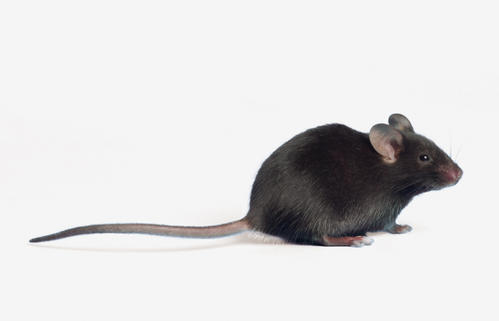
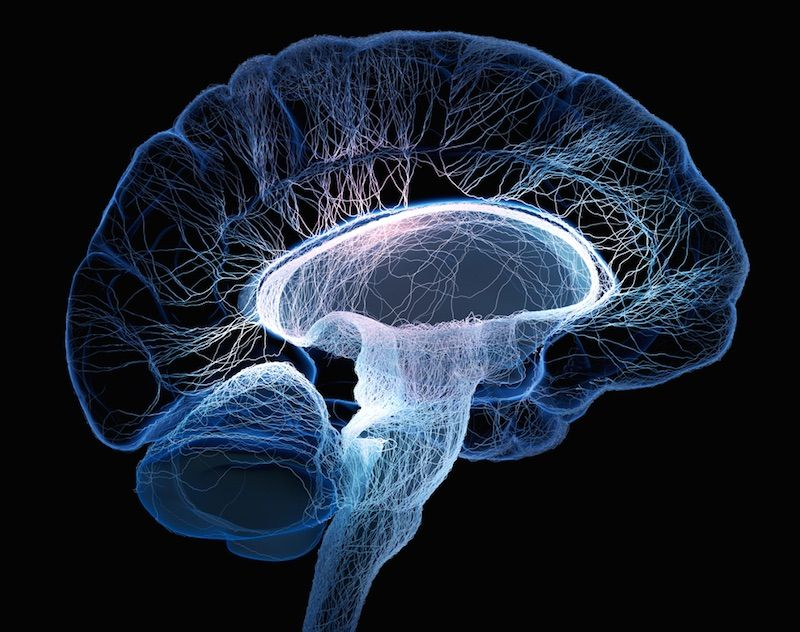

 

## Personal Information

* Name: Jingyi Zhang
* Address: Xinjiekou Outer St. No. 19, Haidian district, Beijing, China 100875
* Email: jz3297@cumc.columbia.edu
* Phone: +8617600140611 (China)
* Weibo: @Paradoxloop_
* Instagram: @effyzhangc

 

## Education Background

* 2015-2019 B.S. in Neuroscience, Psychology minor, Indiana University Bloomington
* 2020-2022(expected) M.S. in Biostatistics, Columbia University

 

## Research/Job Experiences

### *Research Assistant, September 2017 - December 2018*
* Indiana University, Bloomington, IN
  + Department of Psychological and Brain Sciences
  + Dr. Jeff Albert's Animal Behavior Lab
  + NIH-funded project that investigates the association between maternal gut microbiome and neurobehavioral development in mouse offspring in relevant to developmental disorders of human social functioning such as autism spectrum disorders.
  + Supervisor: Sayuri Kojima, Ph.D.
      - Maintained the mouse colony
      - Collected fecal samples from adult and infant mice
      - Administrated prebiotics to mouse pups
      - Scored rodent behaviors (behavioral coding)
      - Punched out brain tissues from selected brain regions

 

 

## Projects

coming soon ...

 

## Skills

* Fluent in English and Chinese (native)
* Experience with R Statistical packages

 

## Other Related Links 

* [Google](https://www.google.com/)
* [P8105](https://p8105.com)

